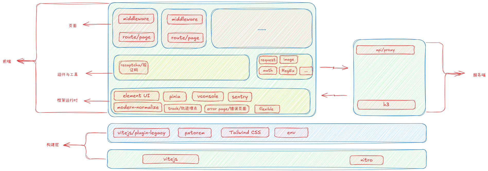

# 基于Nuxt的C端应用模板

## 介绍

这是一个使用Nuxt框架构建的C端应用模板，集成了多种常用功能和最佳实践，旨在帮助开发者快速启动和构建现代Web应用。

## 特性

- 基于Nuxt 4的服务端渲染（SSR）
- 兼容性处理，支持旧版浏览器
- 支持移动端自适应开发
- 集成Tailwind CSS
- 环境变量配置，支持多环境切换
- 集成UI组件库（如Vant UI,Element Plus UI）
- 集成Pinia状态管理
- 集成VConsole移动端调试工具
- 集成Sentry进行错误监控和性能追踪
- 集成modern-normalize，确保样式一致性
- 前端路由守卫中间件
- 错误展示页面
- 集成图片验证码组件
- 集成轨迹数据收集
- 代理服务端接口，解决跨域问题
- 封装请求库、图片工具库、数学工具库和正则工具库

## 架构设计

## 构建层

### 基于Nuxt 4的服务端渲染（SSR）

传统的服务端渲染应用做法大多都是多页架构的。单页架构的应用大多都是以客户端为主的渲染方式。Nuxt 4结合了两者的优点，既能享受单页应用的流畅体验，又能利用服务端渲染提升首屏加载速度和SEO效果。

### 兼容性处理

集成@vitejs/plugin-legacy vite插件，自动为不支持ESM的浏览器生成兼容代码，提升应用的兼容性和用户覆盖面。

### 支持移动端自适应开发

通过在工具链中集成pxtorem插件，页面元标签配置viewport, 配合监听屏幕大小改变根标签字体大小脚本，实现移动端自适应布局。

### 集成Tailwind CSS

集成Tailwind CSS，提供实用的CSS工具类，帮助开发者快速构建响应式和现代化的用户界面。

### 环境变量配置

通过环境变量区分不同的运行环境（开发、qa、测试、生产），实现配置的灵活管理和切换，提升应用的可维护性。

### eslint代码规范检查和prettier代码格式化

## 框架运行时层

### 集成UI组件库

集成了流行的UI组件库（如Vant UI,Element Plus UI），提供丰富的预设组件，帮助开发者快速构建美观且一致的用户界面，并根据页面类型选择性集成。

### 集成状态管理

集成Pinia作为状态管理库，提供简洁且高效的状态管理解决方案，支持模块化状态管理，方便维护和扩展。

### 集成移动端调试工具

集成VConsole移动端调试工具，方便开发者在移动设备上进行调试和问题排查，提高开发效率。

### 集成Sentry进行错误监控和性能追踪

集成Sentry服务，实时监控前端后端中的错误和性能问题，帮助开发者及时发现和解决问题，提升应用的稳定性和用户体验。

### 集成modern-normalize

集成modern-normalize，确保不同浏览器之间的样式一致性，减少浏览器默认样式差异带来的问题。

### 中间件

前端路由守卫中间件，处理路由权限验证、提升应用的安全性和用户体验。

## 应用功能层

### 错误展示页面

提供友好的错误页面，在页面路由错误，页面渲染错误等，可提升用户体验。

### 集成图片验证码组件

集成了图片验证码组件，增强应用的安全性，防止恶意请求和自动化攻击。为了提供组件的灵活性，通过vue的插槽提供无头的设计，允许开发者自定义触发容器，从而更好地适应不同的UI需求。

### 集成轨迹数据收集

集成轨迹数据收集功能，帮助开发者了解用户行为和应用使用情况，支持数据分析和优化决策。同时补充类型定义，提升代码的类型安全性和开发体验。

### 工具库

#### 封装请求库

基于框架提供的$fetch封装客户端与服务端使用的请求库，简化API请求流程，提供统一的错误处理和数据转换机制，提高代码的可维护性和复用性。

#### 图片工具库

封装图片处理工具库，提供常用的图片操作功能，如压缩、裁剪、格式转换等，简化图片处理流程，提升应用的性能和用户体验。

#### 数学工具库

封装数学计算工具库，解决js精度问题，简化复杂计算流程，提升代码的可读性和维护性。

#### 正则工具库

封装常用正则表达式工具库，提供便捷的字符串验证和处理功能，提升代码的效率和可靠性。

### 服务端代理

服务端代理接口，解决跨域问题，因为nuxt中的接口调用分为客户端调用和服务端调用两种场景，客户端请求场景下存在跨域问题。

### 集成nuxt 的 agent-skills

集成nuxt 的 agent-skills 模块，实现自动化的内容生成和交互功能，提升用户体验和应用的智能化水平。

### 三方依赖

- lodash: 提供实用的JavaScript工具函数，简化数据处理和操作流程。
- dayjs: 轻量级的日期处理库，简化日期和时间的操作和格式化。
- zod: 强大的数据验证和解析库，提升数据的类型安全性和可靠性。
